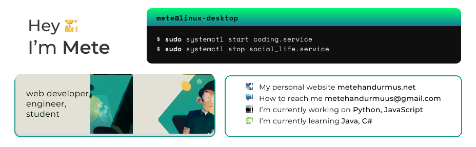

 
<h5 align="left"><b>Languages, Frameworks and Tools</b></h5>

   
   
   
    
   
   
   
   
   
   
   
   
   
   
   
   
   
   
   
   
   
   

 
<h5 align="left"><b>Connect with me</b></h5>

   <a href="https://codepen.io/metehandurmus" target="blank"><code></code></a>
<a href="https://twitter.com/mthndrms" target="blank"><code></code></a>
<a href="https://linkedin.com/in/metehandurmus" target="blank"><code></code></a>
<a href="https://instagram.com/metehanndurmus" target="blank"><code></code></a>
<a href="https://www.hackerrank.com/metehandurmuus" target="blank"><code></code></a>

 
